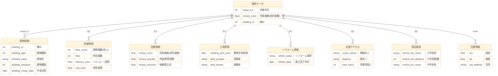
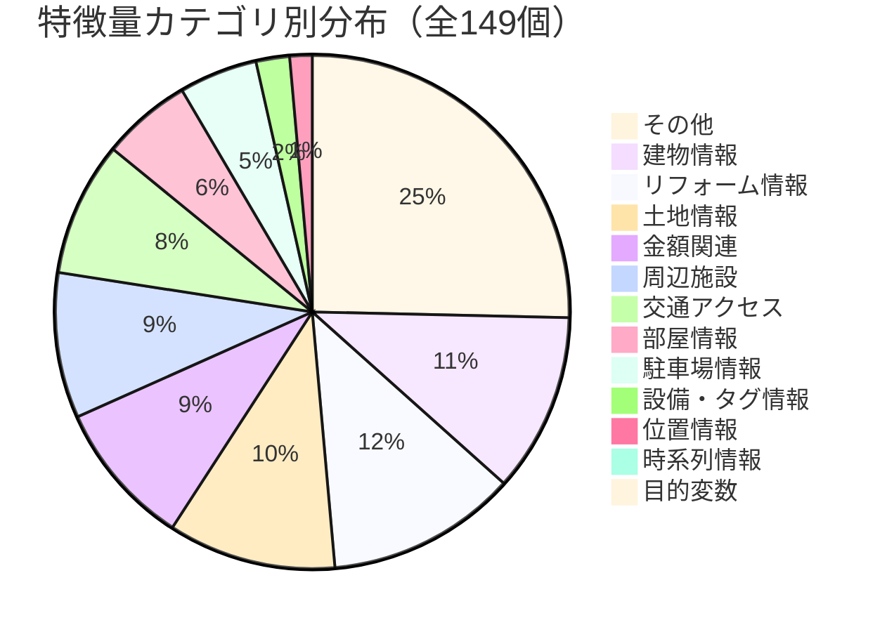
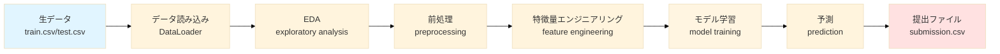

# データ定義書

> **コンペ**: 不動産価格予測（マンション・アパート売買価格）
> **目的変数**: `money_room` (売買価格)
> **総特徴量数**: 149個

---

## 📑 目次

1. [データ全体像](#データ全体像)
   - [データ構造の概要](#データ構造の概要)
   - [特徴量カテゴリの分布](#特徴量カテゴリの分布)
   - [データフロー](#データフロー)
   - [主要カテゴリの説明](#主要カテゴリの説明)
2. [特徴量サマリー](#特徴量サマリー)
3. [特徴量詳細](#特徴量詳細)
   - [目的変数](#目的変数)
   - [時系列情報](#時系列情報)
   - [金額関連](#金額関連)
   - [建物情報](#建物情報)
   - [部屋情報](#部屋情報)
   - [土地情報](#土地情報)
   - [リフォーム情報](#リフォーム情報)
   - [駐車場情報](#駐車場情報)
   - [設備・タグ情報](#設備タグ情報)
   - [位置情報](#位置情報)
   - [交通アクセス](#交通アクセス)
   - [周辺施設](#周辺施設)
   - [住所情報](#住所情報)
   - [その他](#その他)
4. [タグマスタ情報](#タグマスタ情報)
5. [設備情報](#設備情報)
6. [エリア情報](#エリア情報)

---

## 📊 データ全体像

### データ構造の概要

### 特徴量カテゴリの分布

### データフロー

### 主要カテゴリの説明

| カテゴリ | 件数 | 重要度 | 説明 |
|---------|------|--------|------|
| 🎯 目的変数 | 1 | ★★★★★ | 売買価格（money_room）- 予測対象 |
| 🏢 建物情報 | 16 | ★★★★★ | 建物の基本属性（種別、構造、名称など） |
| 💰 金額関連 | 13 | ★★★★☆ | 共益費、修繕積立金など価格に影響する費用 |
| 📍 位置情報 | 2 | ★★★★★ | 経度・緯度 - 立地を表す重要特徴 |
| 🚇 交通アクセス | 12 | ★★★★★ | 最寄り駅・路線情報 - 利便性の指標 |
| 🏫 周辺施設 | 13 | ★★★☆☆ | 学校、病院、コンビニなどの距離 |
| 🏡 部屋情報 | 8 | ★★★★☆ | 専有面積、階数、バルコニーなど |
| 🌳 土地情報 | 15 | ★★★☆☆ | 敷地面積、用途地域、容積率など |
| 🔨 リフォーム情報 | 17 | ★★☆☆☆ | リフォーム箇所と施工日 |
| 🚗 駐車場情報 | 7 | ★★☆☆☆ | 駐車場の有無、料金、台数 |

---

## 特徴量サマリー

| カテゴリ | 件数 | 主な特徴 |
|---------|------|---------|
| 目的変数 | 1件 | 売買価格 |
| 時系列情報 | 1件 | 対象年月 |
| 金額関連 | 13件 | 売買価格、共益費/管理費(代表)、共益費/管理費 税... |
| 建物情報 | 16件 | 棟ID、状態、作成日時... |
| 部屋情報 | 8件 | 建物階数(地上)、所在階数、バルコニー面積... |
| 土地情報 | 15件 | 敷地全体面積、用途地域、都市計画... |
| リフォーム情報 | 17件 | リフォーム箇所（外装）、リフォーム箇所その他（外装）、施工完了年月（外装）... |
| 駐車場情報 | 7件 | 駐車場料金(代表)、駐車場料金 税、駐車場区分... |
| 設備・タグ情報 | 3件 | 投資用物件、経度(日本測地系)、新築・未入居フラグ |
| 位置情報 | 2件 | 経度、緯度 |
| 交通アクセス | 12件 | 路線名１、駅名１、バス停名1... |
| 周辺施設 | 13件 | 小学校名、小学校距離、小学校 学区コード... |
| その他 | 36件 | HOME'S 建物名、HOME'S 建物名フリガナ、総戸数/総区画数... |

---

## 特徴量詳細

### 目的変数

**件数**: 1件

| No. | 特徴量名 | 意味 | 補足 |
|-----|----------|------|------|
| 2 | `money_room` | 売買価格 | 対応する物件の売買価格。目的変数となる。 |

### 時系列情報

**件数**: 1件

| No. | 特徴量名 | 意味 | 補足 |
|-----|----------|------|------|
| 1 | `target_ym` | 対象年月 | 各レコードの抽出対象年月日 yyyymm |

### 金額関連

**件数**: 13件

| No. | 特徴量名 | 意味 | 補足 |
|-----|----------|------|------|
| 2 | `money_room` | 売買価格 | 対応する物件の売買価格。目的変数となる。 |
| 110 | `money_kyoueki` | 共益費/管理費(代表) | 単位：円 |
| 111 | `money_kyoueki_tax` | 共益費/管理費 税 | 1:外税 2:税込み 3:税表示無し(税発生せず)　その他: 欠損 |
| 112 | `money_rimawari_now` | 現行利回り | 単位：％ |
| 113 | `money_shuuzen` | 修繕積立金(代表) | 売買：マンションのみ必須 単位：円 |
| 114 | `money_shuuzenkikin` | 修繕積立基金(代表) | 単位：円 |
| 115 | `money_sonota_str1` | その他費用名目1 | その他必要な費用の名目  その他費用2が入力されている場合は必須 |
| 116 | `money_sonota1` | その他費用1 | 単位：円  その他費用名目1が入力されている場合は必須 |
| 117 | `money_sonota_str2` | その他費用名目2 | その他必要な費用の名目  その他費用2が入力されている場合は必須 |
| 118 | `money_sonota2` | その他費用2 | 単位：円  その他費用名目2が入力されている場合は必須 |
| 119 | `money_sonota_str3` | その他費用名目3 | その他必要な費用の名目  その他費用3が入力されている場合は必須 |
| 120 | `money_sonota3` | その他費用3 | 単位：円  その他費用名目3が入力されている場合は必須 |
| 147 | `money_hoshou_company` | 保証会社費用 | 保証会社の利用 で 1:利用可 2:利用必須 が選択されている場合は必須　その他: 欠損 |

### 建物情報

**件数**: 16件

| No. | 特徴量名 | 意味 | 補足 |
|-----|----------|------|------|
| 3 | `building_id` | 棟ID | AUTO_INCREMENT、UNSIGNED　確認事項参照 |
| 4 | `building_status` | 状態 | 1: 棟が存在する、9: 棟が存在しない |
| 5 | `building_create_date` | 作成日時 | データ作成日時 |
| 6 | `building_modify_date` | 修正日時 | データ修正日時 |
| 7 | `building_type` | 建物種別 | 1: マンション, 3: アパート, その他: 欠損 |
| 8 | `building_name` | 建物名 | - |
| 9 | `building_name_ruby` | 建物名フリガナ | - |
| 16 | `building_structure` | 建物構造 | 1:木造 2:ブロック 3:鉄骨造 4:RC 5:SRC 6:PC 7:HPC 9:その他 10:軽量鉄骨 11:ALC 12:鉄筋ブロック 13:CFT(コンクリート充填鋼管) |
| 18 | `building_area` | 建築面積 | 建築面積 |
| 22 | `building_land_area` | 土地面積 | - |
| 26 | `building_land_chimoku` | 地目 | 地目 　1 :宅地 2: 田 3:畑  4:山林 5 : 雑種地 9 : その他 10:原野 11:田･畑 その他: 欠損 |
| 37 | `building_area_kind` | 建物面積計測方式 | 1:壁芯 2:内法　その他: 欠損 |
| 45 | `building_tag_id` | タグ情報 | スラッシュ(/) 区切り形式 タグマスタシート参照 |
| 51 | `dwelling_unit_window_angle` | 主要採光面 | - |
| 103 | `house_area` | 建物面積/専有面積(代表) | 単位：平米 |
| 105 | `house_kanrinin` | 管理人 | 売買：マンションのみ必須 1:常駐 2:日勤 3:巡回 4:無 (5:非常駐 V3互換用) その他: 欠損 |

### 部屋情報

**件数**: 8件

| No. | 特徴量名 | 意味 | 補足 |
|-----|----------|------|------|
| 19 | `floor_count` | 建物階数(地上) | - |
| 49 | `room_floor` | 所在階数 | - |
| 50 | `balcony_area` | バルコニー面積 | - |
| 52 | `room_count` | 間取部屋数 | - |
| 54 | `floor_plan_code` | 間取り種類コード | 部屋数+間取種類 (Sは丸める) 間取り種類 10:R 20:K,SK 30:DK,SDK 40:LK,SLK 50:LDK,SLDK |
| 106 | `room_kaisuu` | 部屋階数 | 部屋の所在階数 (マイナスの場合は地下) |
| 108 | `madori_number_all` | 間取部屋数(代表) | 部屋の数 |
| 109 | `madori_kind_all` | 間取部屋種類(代表) | 10:R 20:K 25:SK 30:DK 35:SDK 40:LK 45:SLK 50:LDK 55:SLDK その他: 欠損 |

### 土地情報

**件数**: 15件

| No. | 特徴量名 | 意味 | 補足 |
|-----|----------|------|------|
| 23 | `land_area_all` | 敷地全体面積 | 敷地全体の面積 |
| 27 | `land_youto` | 用途地域 | 1:第一種低層住居専用 2:第二種中高層住居専用 3:第二種住居 4:近隣商業 5:商業 6:準工業 7:工業 8:工業専用 10:第二種低層住居専用 11:第一種中高層住居専用 12:第一種住居 13:準住居 14:田園住居地域 99:無指定 |
| 28 | `land_toshi` | 都市計画 | 1:市街化区域 2:市街化調整区域 3:非線引区域 4:都市計画区域外 その他: 欠損 |
| 29 | `land_chisei` | 地勢 | 1:平坦 2:高台 3:低地 4:ひな段 5:傾斜地 9:その他　その他: 欠損 |
| 30 | `land_area_kind` | 土地面積計測方式 | 1:公簿 2:実測 その他: 欠損 |
| 31 | `land_setback_flg` | セットバック | 1:無し 2:有り その他: 欠損 |
| 32 | `land_setback` | セットバック量 | 単位：平米 |
| 33 | `land_kenpei` | 建ぺい率 | 賃貸：土地、売買：土地で「都市計画」が 1:市街化区域 の場合に必須  単位：% |
| 34 | `land_youseki` | 容積率 | 賃貸：土地、売買：土地で都市計画」が 1:市街化区域 の場合に必須  単位：% |
| 35 | `land_road_cond` | 接道状況 | 1:一方 2:角地 3:三方 4:四方 5:二方(除角地) 10:接道なし　その他: 欠損 |
| 36 | `land_seigen` | 法令上の制限 | - |
| 99 | `land_shidou_a` | 私道負担割合分母 | - |
| 100 | `land_shidou_b` | 私道負担割合分子 | - |
| 101 | `land_mochibun_a` | 土地持分分母 | - |
| 102 | `land_mochibun_b` | 土地持分分子 | - |

### リフォーム情報

**件数**: 17件

| No. | 特徴量名 | 意味 | 補足 |
|-----|----------|------|------|
| 40 | `reform_exterior` | リフォーム箇所（外装） | スラッシュ(/) 区切り形式 1:屋根 2:外壁 |
| 41 | `reform_exterior_other` | リフォーム箇所その他（外装） | その他外装リフォーム箇所について |
| 42 | `reform_exterior_date` | 施工完了年月（外装） | YYYYMM形式 |
| 43 | `reform_common_area` | リフォーム箇所（共用部分） | 共用部分リフォーム箇所について |
| 44 | `reform_common_area_date` | 施工完了年月（共用部分） | YYYYMM形式 |
| 55 | `reform_date` | リフォーム実施年月日 | - |
| 56 | `reform_place` | リフォーム箇所 | - |
| 57 | `reform_place_other` | リフォーム箇所その他 | - |
| 58 | `reform_wet_area` | リフォーム箇所（水回り） | スラッシュ(/) 区切り形式 1:キッチン 2:浴室 3:トイレ 4:洗面所 5:給湯器 6:給排水管 |
| 59 | `reform_wet_area_other` | リフォーム箇所その他（水回り） | その他水回りリフォーム箇所について |
| 60 | `reform_wet_area_date` | 施工完了年月（水回り） | YYYYMM形式 |
| 61 | `reform_interior` | リフォーム箇所（内装） | スラッシュ(/) 区切り形式 1:内装全面（床、壁、天井、建具すべて） 2:壁、天井（クロス、塗装等） 3:全室クロス張替 4:床（フローリング等） 5:建具（室内ドア等） 6:サッシ |
| 62 | `reform_interior_other` | リフォーム箇所その他（内装） | その他内装リフォーム箇所について |
| 63 | `reform_interior_date` | 施工完了年月（内装） | YYYYMM形式 |
| 64 | `reform_etc` | リフォーム備考 | その他リフォーム箇所について |
| 65 | `renovation_date` | リノベーション実施年月日 | - |
| 66 | `renovation_etc` | リノベーション備考 | - |

### 駐車場情報

**件数**: 7件

| No. | 特徴量名 | 意味 | 補足 |
|-----|----------|------|------|
| 121 | `parking_money` | 駐車場料金(代表) | 単位：円 |
| 122 | `parking_money_tax` | 駐車場料金 税 | 1:外税 2:税込み 3:税表示無し(税発生せず)　その他: 欠損 |
| 123 | `parking_kubun` | 駐車場区分 | 1:空有 2:空無 3:近隣 4:無 (5:有 V3互換用)　その他: 欠損 |
| 124 | `parking_distance` | 駐車場距離 | 単位：m |
| 125 | `parking_number` | 駐車場空き台数 | 台数が分かっている場合入力 未入力時はなにも表示しない |
| 126 | `parking_memo` | 駐車場備考 | 備考 |
| 146 | `parking_keiyaku` | 契約形態 | 1:駐車場契約必須(賃料に含む) 2:駐車場契約必須（駐車場料金別) |

### 設備・タグ情報

**件数**: 3件

| No. | 特徴量名 | 意味 | 補足 |
|-----|----------|------|------|
| 74 | `flg_investment` | 投資用物件 | 0:通常物件 1:投資用物件 2:事業用物件 |
| 84 | `el` | 経度(日本測地系) | 日本測地系、ミリ秒形式 |
| 104 | `flg_new` | 新築・未入居フラグ | 0:中古 1:新築・未入居 |

### 位置情報

**件数**: 2件

| No. | 特徴量名 | 意味 | 補足 |
|-----|----------|------|------|
| 14 | `lon` | 経度 | 世界測地系 |
| 15 | `lat` | 緯度 | 世界測地系 |

### 交通アクセス

**件数**: 12件

| No. | 特徴量名 | 意味 | 補足 |
|-----|----------|------|------|
| 85 | `rosen_name1` | 路線名１ | - |
| 86 | `eki_name1` | 駅名１ | - |
| 87 | `bus_stop1` | バス停名1 | バスを使用する場合 |
| 88 | `bus_time1` | バス時間1 | 単位：分 |
| 89 | `walk_distance1` | 徒歩距離1 | 駅またはバス停からの距離（単位：m）。徒歩時間は距離÷80。 |
| 90 | `rosen_name2` | 路線名２ | - |
| 91 | `eki_name2` | 駅名２ | - |
| 92 | `bus_stop2` | バス停名2 | バスを使用する場合 |
| 93 | `bus_time2` | バス時間2 | 単位：分 |
| 94 | `walk_distance2` | 徒歩距離2 | 駅またはバス停からの距離（単位：m）。徒歩時間は距離÷80。 |
| 95 | `traffic_other` | その他交通 | ＸＸインターから車で10分 |
| 96 | `traffic_car` | 車所要時間 | - |

### 周辺施設

**件数**: 13件

| No. | 特徴量名 | 意味 | 補足 |
|-----|----------|------|------|
| 130 | `school_ele_name` | 小学校名 | - |
| 131 | `school_ele_distance` | 小学校距離 | 単位：m |
| 132 | `school_ele_code` | 小学校 学区コード | - |
| 133 | `school_jun_name` | 中学校名 | - |
| 134 | `school_jun_distance` | 中学校距離 | 単位：m |
| 135 | `school_jun_code` | 中学校 学区コード | - |
| 136 | `convenience_distance` | コンビニ距離 | 単位：m |
| 137 | `super_distance` | スーパー距離 | 単位：m |
| 138 | `hospital_distance` | 総合病院距離 | 単位：m |
| 139 | `park_distance` | 公園距離 | 単位：m |
| 140 | `drugstore_distance` | ドラッグストア距離 | 単位：m |
| 141 | `bank_distance` | 銀行距離 | 単位：m |
| 142 | `shopping_street_distance` | 商店街距離 | 単位：m |

### その他

**件数**: 36件

| No. | 特徴量名 | 意味 | 補足 |
|-----|----------|------|------|
| 10 | `homes_building_name` | HOME'S 建物名 | 掲載時の物件名 |
| 11 | `homes_building_name_ruby` | HOME'S 建物名フリガナ | 掲載時の物件名ルビ |
| 12 | `unit_count` | 総戸数/総区画数 | 物件の総数 (部屋:総戸数 土地:総区画数) |
| 13 | `full_address` | 住所 | 全住所文字列 |
| 17 | `total_floor_area` | 延べ床面積 | 建物全体の床面積 |
| 20 | `basement_floor_count` | 建物階数(地下) | - |
| 21 | `year_built` | 築年月 | 建築年月 yyyymm |
| 24 | `unit_area_min` | 専有面積 下限 | - |
| 25 | `unit_area_max` | 専有面積 上限 | - |
| 38 | `management_form` | 管理形態 | 売買：マンションの場合に必須  1:自主管理 2:一部委託 3:全部委託 その他: 欠損 |
| 39 | `management_association_flg` | 管理組合有無 | 1:無し 2:有り　その他: 欠損 |
| 46 | `unit_id` | 住戸ID | AUTO_INCREMENT、UNSIGNED　確認事項参照 |
| 47 | `unit_name` | 戸名称 | 戸名称（部屋番号名） |
| 48 | `name_ruby` | 戸名称フリガナ | 戸名称のフリガナ |
| 53 | `unit_area` | 専有面積 | - |
| 67 | `unit_tag_id` | タグ情報 | スラッシュ(/) 区切り形式 タグマスタシート参照 |
| 68 | `bukken_id` | 物件ID | - |
| 69 | `snapshot_create_date` | 作成日時 | データの作成日 |
| 70 | `new_date` | 公開日時 | データの直近の公開日 |
| 71 | `snapshot_modify_date` | 修正日時 | データの修正日 |
| 72 | `timelimit_date` | 情報掲載期限日 | データの情報掲載期限日 居住用賃貸(31)：7日以内 それ以外：14日以内 |
| 73 | `bukken_type` | 物件種別 | 1202: 中古一戸建 1302: 中古マンション |
| 75 | `empty_number` | 空き物件数 | 物件の空き数 (部屋:空部屋数 土地:販売区画数等) |
| 76 | `empty_contents` | 空き物件内容 | 部屋:空部屋の番号 土地:区画番号等 |
| 83 | `nl` | 緯度(日本測地系) | 日本測地系、ミリ秒形式 |
| 97 | `snapshot_land_area` | 区画面積(代表) | 単位：平米 |
| 98 | `snapshot_land_shidou` | 私道負担面積(代表) | 単位：平米 |
| 107 | `snapshot_window_angle` | 向き | 1:北 2:北東 3:東 4:南東 5:南 6:南西 7:西 8:北西　その他: 欠損 |
| 127 | `genkyo_code` | 現況 | (土地の場合)1:更地 2:古屋あり 10:古屋あり更地引渡可 (戸建・マン・外全・外一の場合)1:居住中 2:空家 3:賃貸中 4:未完成 その他: 欠損 |
| 128 | `usable_status` | 引渡/入居時期 | 1:即時 2:相談 3:期日指定 (4:未定 V3互換用)　その他: 欠損 現況が居住中、賃貸中、未完成の場合は、期日指定、相談のみ選択可能 |
| 129 | `usable_date` | 引渡/入居年月 | 年月（引渡/入居時期で期日指定をした場合のみ) |
| 143 | `est_other_name` | 施設その他 | - |
| 144 | `est_other_distance` | 施設その他距離 | 単位：m |
| 145 | `statuses` | 設備情報 | スラッシュ(/) 区切り形式 物件マスタとは別コード 設備情報シート参照 |
| 148 | `free_rent_duration` | フリーレント期間 | 単位：月 |
| 149 | `free_rent_gen_timing` | フリーレント賃料発生タイミング | yyyymm形式 |

---

## タグマスタ情報

**総タグ数**: 257種類

タグIDは `building_tag_id` に格納され、スラッシュ(/)区切り形式で複数指定可能。

### タグカテゴリ一覧

| カテゴリID | カテゴリ名 | タグ数 |
|-----------|-----------|--------|
| 11xxxx | 入居条件 | 31件 |
| 12xxxx | 契約・権利 | 15件 |
| 19xxxx | 販売状況 | 6件 |
| 21xxxx | インフラ・電力 | 14件 |
| 22xxxx | 水回り設備 | 20件 |
| 23xxxx | キッチン設備 | 17件 |
| 24xxxx | 空調・暖房 | 5件 |
| 25xxxx | 収納 | 10件 |
| 26xxxx | 通信設備 | 11件 |
| 27xxxx | リノベ・リフォーム | 2件 |
| 28xxxx | 間取り | 4件 |
| 29xxxx | 室内設備 | 22件 |
| 31xxxx | セキュリティ | 7件 |
| 32xxxx | 共用施設 | 13件 |
| 33xxxx | 建物特性 | 38件 |
| 34xxxx | 位置・向き | 10件 |
| 35xxxx | 土地現況 | 3件 |
| 39xxxx | その他特徴 | 3件 |
| 41xxxx | 周辺商業施設 | 3件 |
| 42xxxx | 周辺公共施設 | 6件 |
| 43xxxx | 交通利便性 | 2件 |
| 51xxxx | HOME'S認定 | 15件 |

タグ詳細を表示

#### 入居条件 (11xxxx)

| タグID | タグ内容 |
|--------|----------|
| `110101` | 楽器相談 |
| `110102` | 楽器不可 |
| `110201` | 事務所可 |
| `110202` | 事務所不可 |
| `110301` | 二人入居可 |
| `110302` | 二人入居不可 |
| `110401` | 男性限定 |
| `110402` | 女性限定 |
| `110501` | 単身者限定 |
| `110502` | 単身者希望 |
| `110503` | 単身者不可 |
| `110601` | 法人限定 |
| `110602` | 法人希望 |
| `110603` | 法人不可 |
| `110701` | 学生限定 |
| `110702` | 学生歓迎 |
| `110801` | 高齢者限定 |
| `110802` | 高齢者歓迎 |
| `110901` | ペット可 |
| `110902` | ペット相談 |
| `110903` | ペット不可 |
| `111001` | 建築条件付き |
| `111002` | 建築条件なし |
| `113301` | 家賃カード決済可 |
| `113302` | 初期費用カード決済可 |
| `113303` | 家賃・初期費用カード決済可 |
| `113401` | ルームシェア可 |
| `113402` | ルームシェア不可 |
| `113501` | セキュリティ会社加入済み |
| `113601` | フリーレント |
| `113701` | カスタマイズ可 |

#### 契約・権利 (12xxxx)

| タグID | タグ内容 |
|--------|----------|
| `120101` | 礼金なし |
| `120201` | 敷金なし |
| `120301` | 所有権 |
| `120401` | 定期借家権 |
| `120501` | 公庫利用可 |
| `120601` | 手付金保証あり |
| `120801` | 家賃保証付き |
| `121001` | 保証人要 |
| `121002` | 保証人不要 |
| `121101` | 特優賃（特定優良賃貸住宅） |
| `123201` | マンスリー可 |
| `123301` | フラット35適用可能 |
| `123401` | 瑕疵担保付き |
| `123501` | 仲介手数料不要 |
| `123601` | 売主・代理 |

#### 販売状況 (19xxxx)

| タグID | タグ内容 |
|--------|----------|
| `190101` | 現地内覧可能 |
| `193201` | モデルルーム公開中 |
| `193301` | 販売中 |
| `193401` | 販売予定 |
| `193501` | 自由設計対応 |
| `193601` | 間取り変更可能 |

#### インフラ・電力 (21xxxx)

| タグID | タグ内容 |
|--------|----------|
| `210101` | 公営水道 |
| `210102` | 井戸 |
| `210199` | 水道その他 |
| `210201` | 都市ガス |
| `210202` | プロパンガス |
| `210299` | ガスその他 |
| `210301` | 下水 |
| `210302` | 浄化槽 |
| `210303` | 汲取 |
| `210399` | 排水その他 |
| `210401` | オール電化 |
| `213101` | 太陽光発電 |
| `213201` | マイホーム発電システム |
| `213301` | スマートハウス |

#### 水回り設備 (22xxxx)

| タグID | タグ内容 |
|--------|----------|
| `220101` | 専用バス |
| `220102` | 共同バス |
| `220103` | バスなし |
| `220201` | 専用トイレ |
| `220202` | 共同トイレ |
| `220203` | トイレなし |
| `220301` | バス・トイレ別 |
| `220401` | 追い焚き |
| `220501` | シャワー |
| `220601` | 洗髪洗面化粧台 |
| `220701` | 温水洗浄便座 |
| `220801` | 浴室乾燥機 |
| `220901` | 浴室1.6×2.0M以上 |
| `220902` | 浴室1.6×1.8M以上 |
| `223101` | 独立洗面台 |
| `223201` | 浴室TV |
| `223301` | 浴室窓有 |
| `223401` | 浴室暖房 |
| `223501` | オートバス |
| `223601` | 高温差湯式 |

#### キッチン設備 (23xxxx)

| タグID | タグ内容 |
|--------|----------|
| `230101` | ガスコンロ設置済 |
| `230102` | 電気コンロ |
| `230103` | IHコンロ |
| `230201` | コンロ一口 |
| `230202` | コンロ二口 |
| `230203` | コンロ三口 |
| `230204` | コンロ四口以上 |
| `230302` | コンロ三口以上 |
| `230401` | システムキッチン |
| `230501` | カウンターキッチン |
| `230601` | 食器洗い乾燥機 |
| `230701` | ディスポーザー |
| `230801` | 給湯 |
| `230802` | 高効率給湯器 |
| `230901` | 冷蔵庫あり |
| `233101` | 浄水器・活水器 |
| `233201` | ガスコンロ |

#### 空調・暖房 (24xxxx)

| タグID | タグ内容 |
|--------|----------|
| `240101` | 冷房 |
| `240102` | ガス暖房 |
| `240103` | 石油暖房 |
| `240104` | エアコン |
| `240201` | 床暖房 |

#### 収納 (25xxxx)

| タグID | タグ内容 |
|--------|----------|
| `250101` | トランクルーム |
| `250201` | 床下収納 |
| `250301` | ウォークインクローゼット |
| `253101` | 屋根裏収納 |
| `253201` | シューズクローク |
| `253301` | パントリー |
| `253401` | 全居室収納 |
| `253501` | クローゼット |
| `253601` | シューズボックス |
| `253701` | シューズインクローゼット |

#### 通信設備 (26xxxx)

| タグID | タグ内容 |
|--------|----------|
| `260101` | CATV |
| `260201` | CS対応 |
| `260301` | BS対応 |
| `260401` | 有線放送 |
| `260501` | インターネット対応 |
| `260502` | 高速インターネット |
| `260503` | 光ファイバー |
| `260601` | ブロードバンド |
| `263101` | インターネット利用料無料 |
| `263201` | CATV利用料無料 |
| `263301` | ブロードバンド |

#### リノベ・リフォーム (27xxxx)

| タグID | タグ内容 |
|--------|----------|
| `270101` | リノベーション物件 |
| `273101` | リフォーム物件 |

#### 間取り (28xxxx)

| タグID | タグ内容 |
|--------|----------|
| `283101` | LDK15帖以上 |
| `283201` | シングル＆DINKS向け |
| `283301` | 4LDK以上 |
| `283401` | メゾネット |

#### 室内設備 (29xxxx)

| タグID | タグ内容 |
|--------|----------|
| `294201` | 太陽光発電システム |
| `290101` | フローリング |
| `290201` | 専用庭 |
| `290301` | 出窓 |
| `290401` | バルコニー |
| `290501` | 二世帯住宅向き |
| `290601` | バリアフリー |
| `290701` | フリーアクセス |
| `290801` | ロフト付き |
| `290901` | 室内洗濯機置場 |
| `290902` | 洗濯機置場あり |
| `293101` | 家具・家電付 |
| `293201` | メゾネット |
| `293301` | ルーフバルコニー |
| `293401` | 内廊下 |
| `293501` | 複層ガラス採用（二重サッシ・防犯サッシ等） |
| `293601` | テラス |
| `293701` | 庭が広い |
| `293801` | 吹き抜け |
| `294001` | 和室 |
| `294101` | 屋上・ルーフバルコニー |
| `294301` | 照明器具付 |

#### セキュリティ (31xxxx)

| タグID | タグ内容 |
|--------|----------|
| `310101` | オートロック |
| `310201` | 防犯カメラ |
| `310301` | 管理人常駐 |
| `310401` | 24時間有人管理 |
| `313101` | セキュリティ充実 |
| `310501` | TVモニタ付インターホン |
| `313301` | ホームセキュリティ対応 |

#### 共用施設 (32xxxx)

| タグID | タグ内容 |
|--------|----------|
| `320101` | エレベーター |
| `320201` | ごみ出し24時間OK |
| `320301` | ペット用施設 |
| `320401` | フロントサービス |
| `320501` | キッズルーム |
| `320701` | 駐車場完備 |
| `320801` | 駐車場あり |
| `320901` | バイク置き場あり |
| `321001` | 駐輪場あり |
| `321101` | 宅配ボックス |
| `323101` | 託児所付き |
| `323201` | コンシェルジュサービス |
| `320601` | 駐車場2台以上 |

#### 建物特性 (33xxxx)

| タグID | タグ内容 |
|--------|----------|
| `330101` | デザイナーズ |
| `330201` | 大規模マンション |
| `330301` | タワーマンション |
| `330401` | 低層マンション |
| `330501` | タイル貼り |
| `330601` | 外断熱 |
| `333201` | 3階建て |
| `333301` | 低層住宅地 |
| `333401` | 総戸数・総区画数30以上 |
| `333402` | 総戸数・総区画数が10以上〜30未満 |
| `333601` | ハイグレードマンション |
| `333801` | 分譲物件 |
| `334001` | 免震構造 |
| `334101` | 耐震構造 |
| `334201` | 制震構造 |
| `334301` | リゾートマンション |
| `334501` | 耐震・制震・免震構造 |
| `331001` | 分譲賃貸 |
| `334401` | 100m2以上 |
| `330701` | 保証付住宅 |
| `330801` | 住宅性能保証制度証明書 |
| `330901` | 住宅性能評価書 |
| `334801` | 設計住宅性能評価書 |
| `335001` | フラット35・S適合証明書 |
| `335101` | 長期優良住宅認定通知書 |
| `335201` | 耐震基準適合証明書 |
| `335301` | 建設住宅性能評価書（新築時） |
| `335401` | 建設住宅性能評価書（既存住宅） |
| `335501` | 建築確認完了検査済証 |
| `335601` | 法適合状況調査報告書 |
| `335701` | 低炭素住宅 |
| `335901` | 瑕疵保険（国交省指定）による保証利用可 |
| `335902` | 瑕疵保険（国交省指定）による保証付 |
| `336001` | 瑕疵保証（不動産会社独自）付 |
| `336101` | インスペクション（建物検査）報告書 |
| `336201` | 新築時・増改築時の設計図書 |
| `336301` | 修繕・点検の記録 |
| `336501` | BELS/省エネ基準適合認定建築物 |

#### 位置・向き (34xxxx)

| タグID | タグ内容 |
|--------|----------|
| `340301` | 角地 |
| `343201` | 南道路 |
| `343301` | 敷地延長・変形地 |
| `340101` | 1階の物件 |
| `340102` | 2階以上 |
| `340103` | 地下 |
| `340201` | 最上階 |
| `340401` | 角部屋 |
| `340501` | 南向き |
| `343101` | 南向き |

#### 土地現況 (35xxxx)

| タグID | タグ内容 |
|--------|----------|
| `350101` | 更地 |
| `350102` | 古家あり |
| `350301` | 即入居可 |

#### その他特徴 (39xxxx)

| タグID | タグ内容 |
|--------|----------|
| `393101` | 環境にやさしい |
| `393201` | 子育てに優しい環境 |
| `393401` | マンション管理評価書付き |

#### 周辺商業施設 (41xxxx)

| タグID | タグ内容 |
|--------|----------|
| `410101` | スーパー800m以内 |
| `410201` | コンビニ400m以内 |
| `410203` | コンビニ 800ｍ以内 |

#### 周辺公共施設 (42xxxx)

| タグID | タグ内容 |
|--------|----------|
| `420101` | 小学校800m以内 |
| `423103` | 総合病院800m以内 |
| `423201` | 公園400m以内 |
| `423301` | フィットネス施設（プール含む）800ｍ以内 |
| `423401` | 中学校 800m以内 |
| `423501` | 保育園・幼稚園 400m以内 |

#### 交通利便性 (43xxxx)

| タグID | タグ内容 |
|--------|----------|
| `433201` | 複数路線 |
| `433301` | 最寄り駅が始発駅 |

#### HOME'S認定 (51xxxx)

| タグID | タグ内容 |
|--------|----------|
| `513601` | 大規模分譲地 |
| `513701` | LIFULL HOME'S 認定物件 |
| `513801` | LIFULL HOME'S 住宅評価 |
| `513901` | 瑕疵保険(保証付き) |
| `513902` | 瑕疵保険(利用可能) |
| `513903` | 瑕疵保険(対象外) |
| `514001` | 設備保証付き |
| `514002` | 認定基準以上の設備保証付き |
| `514101` | シロアリ検査(保証付き) |
| `514102` | シロアリ検査(不適合又は不明) |
| `514103` | シロアリ検査(検査合格) |
| `514201` | 価格査定マニュアル活用 |
| `514301` | オンライン内見可 |
| `514401` | オンライン相談可 |
| `514501` | IT重説可 |

---

## 設備情報

**総設備タグ数**: 301種類

設備情報は `statuses` に格納され、スラッシュ(/)区切り形式で複数指定可能。

※ 設備情報のカテゴリはタグマスタと同様のため、詳細は上記タグマスタ情報を参照。

### 主要設備カテゴリ

| カテゴリ | 例 |
|---------|-----|
| 入居条件 | 楽器可、ペット可、単身者限定 |
| 水回り | バストイレ別、追焚機能、浴室乾燥機 |
| キッチン | システムキッチン、IHコンロ、食洗機 |
| セキュリティ | オートロック、防犯カメラ、TVモニタ |
| 共用施設 | エレベーター、宅配ボックス、駐輪場 |

---

## エリア情報

**総エリア数**: 1953エリア（都道府県・市区町村）

### 都道府県別エリア数

| 都道府県 | 市区町村数 |
|---------|-----------|
| 三重県 | 30件 |
| 京都府 | 37件 |
| 佐賀県 | 21件 |
| 兵庫県 | 50件 |
| 北海道 | 195件 |
| 千葉県 | 60件 |
| 和歌山県 | 31件 |
| 埼玉県 | 73件 |
| 大分県 | 19件 |
| 大阪府 | 73件 |
| 奈良県 | 40件 |
| 宮城県 | 40件 |
| 宮崎県 | 27件 |
| 富山県 | 16件 |
| 山口県 | 20件 |
| 山形県 | 36件 |
| 山梨県 | 28件 |
| 岐阜県 | 43件 |
| 岡山県 | 31件 |
| 岩手県 | 34件 |
| ... | ... |
| **合計** | **1953エリア** |

---

## 補足

- タグ情報はスラッシュ(/)区切りで複数設定可能
- 位置情報は世界測地系（WGS84）を使用
- 築年月は yyyymm 形式
- 距離単位はメートル（m）
- 面積単位は平米（㎡）

---

**作成日**: 2025-11-22